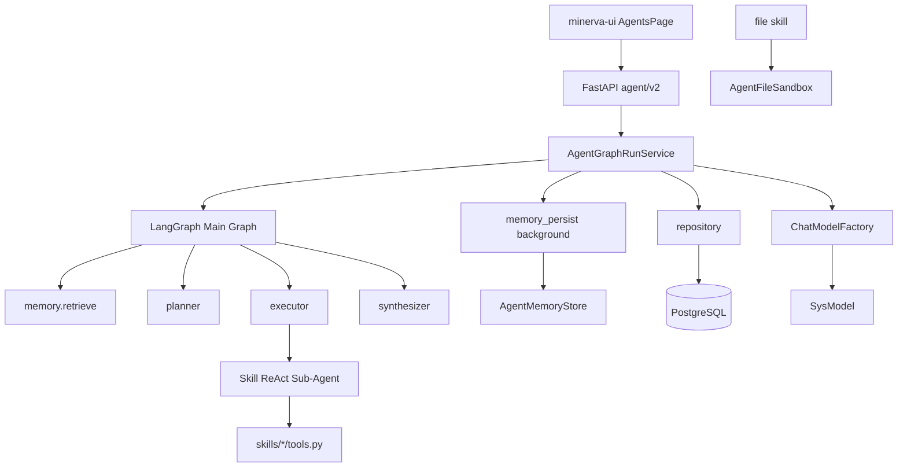

# Agent 模块技术设计说明

**路径**：`backend/app/agent`  
**版本**：与代码库同步（LangGraph Plan-and-Execute + Skills）；**以本文件与代码为准**（2026-05-18 已从代码回填修订 `docs/superpowers/specs/` 中 Agent 相关 spec）  
**关联设计**：[Agent LangGraph 大改设计](superpowers/specs/2026-05-16-agent-langgraph-redesign-design.md)（§14 实现对照）；历史 [SSE 持久化 v1](superpowers/specs/2026-05-15-agent-sse-persistence-design.md) 已废止

---

## 1. 概述

### 1.1 定位

Agent 模块是 Minerva 工作区内的**多轮智能对话与任务编排**后端实现。用户通过 HTTP API 创建会话、发起 Run，服务端以 **SSE v2** 实时推送规划、子 Agent 执行、工具调用与最终答复，并将消息与运行元数据持久化到 PostgreSQL。

### 1.2 核心能力

| 能力 | 实现方式 |
|------|----------|
| 任务规划 | Planner 节点 + 结构化 `Plan`（Pydantic） |
| 分步执行 | Executor 按步路由到不同 **Skill 子 Agent** |
| 子 Agent | LangGraph `create_react_agent`，每 Skill 独立工具集 |
| 长期记忆 | SQL 表检索 + 历史消息 ILIKE 回退；Run 成功后后台 LLM 抽取写入 |
| 流式可观测 | SSE v2 事件（计划、工具、LLM delta、子 Agent 生命周期） |
| 模型托管 | 请求仅传 `model_id`，由 `ChatModelFactory` 从 `SysModel` 构造 LangChain 客户端 |

### 1.3 技术栈

- **编排**：LangGraph `StateGraph`（外层主图）
- **子推理**：`langgraph.prebuilt.create_react_agent`
- **模型**：`langchain-openai.ChatOpenAI`（OpenAI 兼容 endpoint）
- **持久化**：SQLAlchemy 2.x 异步 + 可选 `AsyncPostgresSaver` checkpoint
- **API**：FastAPI，`/workspaces/{workspace_id}/agent/v2`

### 1.4 非目标（当前实现）

- 向量数据库 / Embedding 检索
- 用户上传自定义 Skill 包（仅内置 `skills/` 目录）
- 旧版 SSE（OpenAI chunk + minerva v1）兼容

---

## 2. 目录结构与分层

```text
backend/app/agent/
├── api/v2/                 # HTTP 路由与 Pydantic 契约
│   ├── router.py
│   └── schemas.py
├── domain/                 # 领域模型（无 I/O）
│   ├── plan.py             # Plan / PlanStep
│   ├── sse_v2.py           # SSE 事件类型与序列化
│   ├── memory_extract.py   # 记忆抽取结构化输出
│   └── db/models.py        # ORM：session / message / run / plan / memory / run_node
├── graphs/                 # LangGraph 主图与节点
│   ├── main.py             # build_main_graph()
│   ├── state.py            # AgentGraphState
│   ├── deps.py             # GraphDeps（每 Run 注入）
│   └── nodes/
│       ├── memory_nodes.py # memory.retrieve
│       ├── planner.py
│       ├── executor.py
│       ├── subagent_runner.py
│       └── synthesizer.py
├── infrastructure/         # 适配器与仓储
│   ├── repository.py
│   ├── chat_model_factory.py
│   ├── chat_history.py
│   ├── skill_loader.py
│   ├── skill_tool_context.py
│   ├── event_mapper.py
│   ├── memory_store.py
│   ├── agent_file_sandbox.py
│   └── langgraph_checkpointer.py
├── service/                # 应用服务（编排入口）
│   ├── agent_graph_run_service.py
│   ├── memory_persist_service.py
│   └── memory_extract_llm.py
└── skills/                 # 内置 Skill 包（INDEX + SKILL.md + tools.py）
    ├── INDEX.md
    ├── general/
    ├── file/
    └── datetime/
```

**分层职责**：

| 层 | 职责 |
|----|------|
| `api` | 鉴权、请求校验、SSE `StreamingResponse` |
| `service` | Run 生命周期、队列化 SSE、调用主图、触发后台记忆 |
| `graphs` | 纯编排逻辑；通过 `RunnableConfig.configurable.deps` 访问 DB/模型/SSE |
| `domain` | 结构化类型、ORM 定义、SSE 信封格式 |
| `infrastructure` | 外部系统适配（DB、模型、Skill 加载、沙箱、事件映射） |
| `skills` | 可扩展能力包：文档驱动路由 + `register_tools` 约定 |

路由注册：`app/core/api/router.py` 挂载 `app.agent.api.v2.router`。

---

## 3. 总体架构



### 3.1 一次 Run 的时序

1. 客户端 `POST .../sessions/{session_id}/runs`，Header 可含 `X-Minerva-Run-Id`（由路由预生成 `run_id`）。
2. `AgentGraphRunService.run_stream_sse` 创建 asyncio 队列，后台任务执行图，主协程从队列读出 SSE 行。
3. 校验会话、加载 `SysModel`、写入 `agent_run` 与用户 `agent_message`。
4. 构建 `GraphDeps`（含截断后的会话历史 LangChain 消息）。
5. `graph.ainvoke(initial_state, config)` 执行主图。
6. 将 `final_answer` 写入 assistant 消息，`finalize_agent_run`，`commit`，发送 `run.finished`。
7. 成功时 **异步** 调度 `schedule_persist_turn_memory_background`（不阻塞 SSE 结束）。
8. 发送 `data: [DONE]`，关闭流。

---

## 4. LangGraph 主图

### 4.1 图拓扑

```text
START → memory.retrieve → planner → executor ⇄ executor
                                              ↓ (无剩余步骤)
                                         synthesizer → END
```

- **条件边**：`route_after_executor` 根据 `current_step_index` 与 `plan.steps` 长度决定继续 `executor` 或进入 `synthesizer`。
- **注意**：长期记忆**写入**不在主图内，而在 Run 成功后的后台任务中完成（见 §8）。

### 4.2 图状态 `AgentGraphState`

| 字段 | 类型 | 说明 |
|------|------|------|
| `session_id`, `run_id`, `workspace_id`, `user_id` | UUID | 运行上下文 |
| `model_id` | UUID | `SysModel.id` |
| `user_message` | str | 本轮用户输入 |
| `preferred_skills` | list[str] | 用户偏好技能 hint（注入 Planner 提示） |
| `plan` | Plan \| None | 结构化计划 |
| `plan_id` | UUID \| None | 持久化后的 `agent_plan.id` |
| `current_step_index` | int | 当前执行步下标 |
| `retrieved_memories` | list[MemoryHit] | 检索到的记忆 |
| `subagent_results` | list[StepResult] | 每步子 Agent 输出 |
| `final_answer` | str \| None | 合成后的用户可见答复 |
| `error` | str \| None | 预留错误字段 |

`StepResult`：`step_id`、`skill_id`、`output`。

### 4.3 运行时依赖 `GraphDeps`

每 Run 通过 `config["configurable"]["deps"]` 注入：

| 字段 | 说明 |
|------|------|
| `db` | 当前请求 `AsyncSession` |
| `model` | `BaseChatModel` |
| `workspace_id`, `session_id`, `run_id`, `user_id` | 标识 |
| `memory_store` | `AgentMemoryStore` 实例 |
| `emit_sse` | 异步回调，写入 SSE 队列 |
| `conversation_messages` | 截断后的 LangChain 历史 |
| `subagent_cache` | `(skill_id, workspace_id) → CompiledStateGraph` 缓存 |

`thread_id`：`{session_id}:{run_id}`，供 LangGraph checkpoint 使用（若启用）。

---

## 5. 图节点说明

### 5.1 `memory.retrieve`

- 调用 `AgentMemoryStore.retrieve`：先查 `agent_long_term_memory`（工作区级 + 会话级 scope），再按需 ILIKE 回退 `agent_message`。
- 发出 SSE `memory.retrieved`（命中数、来源预览）。
- `memory_context_text()` 将命中格式化为 Planner 提示前缀。

### 5.2 `planner`

- 使用 `deps.model.with_structured_output(Plan)` 生成计划。
- 系统提示包含：`skills/INDEX.md` 索引、`build_planner_skill_index()` 汇总的「何时使用 / Planner 路由」。
- 失败或空计划时：`plan_fallback_skill_id()` 按触发词或默认 `general` 单步兜底。
- `apply_planner_skill_match()`：单步计划若命中 SKILL 触发词则校正 `skill_id`。
- 步数上限：`settings.agent_max_plan_steps`（默认 8）。
- 持久化 `AgentPlan`，SSE `plan.created`，`agent_run_node` 记录 `plan.created`。

### 5.3 `executor`

- 读取 `plan.steps[current_step_index]`，标记 `running`，SSE `plan_step_updated` + `subagent_started`。
- `build_skill_react_agent(model, skill_id, SkillToolContext)` 按需编译 ReAct 子图。
- `run_subagent_with_stream()`：`astream_events` v2 → `event_mapper` → SSE（`llm.delta` / `tool.*`）。
- 子 Agent 输入：`messages_with_user_input(history, step.goal)`。
- 步完成后追加 `StepResult`，`current_step_index += 1`。

### 5.4 `synthesizer`

- **无子 Agent 结果**：直接对会话历史流式生成，`llm.delta` + `phase: synthesizer`。
- **单步且已有输出**：`resolve_final_answer_from_subagent_results` 直接返回，避免重复流式（子 Agent 已发过 delta）。
- **多步**：非流式调用模型，将各步输出合并为中文答复（不再向客户端推 synthesizer delta）。

### 5.5 子 Agent 执行 `subagent_runner`

- `recursion_limit`：`settings.agent_subagent_recursion_limit`（默认 16）。
- 从 `on_chain_end` 或最终 `ainvoke` 提取最后一条 AI 文本作为步骤 `output`。

---

## 6. Skill 子系统

### 6.1 注册与发现

- **索引**：`skills/INDEX.md` 的「子技能列表」定义 `id` 与一行描述（兼作子 Agent 系统提示首段）。
- **详情**：`skills/<id>/SKILL.md` 含 `## 何时使用`、`## Planner 路由`（触发词列表，子串匹配，INDEX 顺序优先）。
- **工具**：`skills/<id>/tools.py` 实现 `register_tools(ctx: SkillToolContext) -> list[Tool]`。

`skill_loader.py` 负责解析、构建 Planner 索引、加载工具、`create_react_agent` 编译子图。

### 6.2 内置 Skill

| ID | 工具 | 职责 |
|----|------|------|
| `datetime` | `get_system_datetime` | 返回服务器 UTC/LOCAL 时间 JSON，禁止编造实时时间 |
| `file` | `list_dir`, `read_file`, `write_file`, `delete_path`, `mkdir`, `move_path` | 工作区沙箱内文件操作 |
| `general` | 无 | 纯对话，无工具 |

### 6.3 文件沙箱 `AgentFileSandbox`

- 根路径：`resolve_agent_files_root()` → 默认 `backend/data/agent-files`，每工作区 `workspaces/<workspace_id>/`。
- 单文件大小：`settings.agent_file_max_bytes`（默认 512KB）。
- 工具返回统一 JSON 字符串（`ok` 或错误结构）。

### 6.4 扩展新 Skill

1. 在 `skills/` 下新建目录，添加 `SKILL.md`（含路由段）与 `tools.py`（`register_tools`）。
2. 在 `INDEX.md` 增加列表项（顺序影响 Planner 触发词优先级）。
3. `PlanStep.skill_id` 校验自动读取 INDEX，无需改 Planner 硬编码。

---

## 7. 数据模型（PostgreSQL）

| 表 | 说明 |
|----|------|
| `agent_session` | 工作区会话；`summary_text` 滚动摘要 |
| `agent_message` | 有序消息（`seq` 唯一）；role/content/tool 相关 JSON |
| `agent_run` | 单次 Run；`request_meta_json` 存 model_id、preferred_skills 等 |
| `agent_plan` | Run 的计划快照 `steps_json` |
| `agent_long_term_memory` | 长期记忆 fact/summary；可按 key upsert |
| `agent_run_node` | 细粒度节点树（planner、subagent、memory.persist 等） |

删除会话时依赖 FK `ON DELETE CASCADE` 级联清理关联数据。

---

## 8. 长期记忆

### 8.1 检索（Run 开始时）

`AgentMemoryStore.retrieve`：

1. 查 `agent_long_term_memory`（`workspace_id` + session 级或全局 `session_id IS NULL`）。
2. 有 query 时对 `content`/`key` ILIKE。
3. 不足时回退同会话 `agent_message` ILIKE。

上限：`agent_memory_retrieve_limit`（默认 20）。

### 8.2 持久化（Run 成功后，后台）

`memory_persist_service.schedule_persist_turn_memory_background`：

1. 独立 DB Session + 同一 `model_id` 构造模型。
2. `invoke_memory_extract` → 结构化 `MemoryExtract`（summary + 最多 5 条 fact）。
3. `insert_summary`、`upsert_fact`、`touch_session_summary`。
4. 写入 `agent_run_node`（`memory.persist`）。

与主图解耦，避免拉长 SSE 连接时间。

---

## 9. HTTP API（v2）

**前缀**：`/workspaces/{workspace_id}/agent/v2`  
**鉴权**：`require_workspace_member` + `get_current_user`（Run 创建）

| 方法 | 路径 | 说明 |
|------|------|------|
| GET | `/skills` | 内置技能列表 |
| POST | `/sessions` | 创建会话 |
| GET | `/sessions` | 最近会话（cursor 分页） |
| GET | `/sessions/{session_id}` | 会话详情 + 消息历史 |
| DELETE | `/sessions/{session_id}` | 删除会话 |
| POST | `/sessions/{session_id}/runs` | 发起 Run，**SSE** 响应 |

### 9.1 Run 请求体 `AgentRunCreateV2`

```json
{
  "user_message": "用户问题",
  "model_id": "uuid",
  "temperature": 0.7,
  "max_tokens": 4096,
  "preferred_skills": ["file"]
}
```

### 9.2 SSE v2 信封

每行：`data: {json}\n\n`，结束：`data: [DONE]\n\n`。

```json
{
  "v": 2,
  "type": "run.started | plan.created | llm.delta | ...",
  "run_id": "...",
  "session_id": "...",
  "ts": "ISO-8601 UTC",
  "payload": { }
}
```

| `type` | 典型 payload |
|--------|----------------|
| `run.started` / `run.finished` / `run.error` | status、错误码 |
| `plan.created` | plan_id、steps |
| `plan.step_updated` | step_id、status、skill_id |
| `subagent.started` / `subagent.finished` | skill_id、step_id |
| `llm.delta` | channel: assistant \| reasoning、text、step_id、skill_id |
| `tool.started` / `tool.finished` | name、arguments_preview / result_preview |
| `memory.retrieved` | hit_count、sources |

实现见 `domain/sse_v2.py`、`infrastructure/event_mapper.py`。

---

## 10. 基础设施组件

| 组件 | 文件 | 说明 |
|------|------|------|
| `AgentGraphRunService` | `service/agent_graph_run_service.py` | Run 编排与 SSE 队列 |
| `ChatModelFactory` | `infrastructure/chat_model_factory.py` | `SysModel` → `ChatOpenAI` |
| `repository` | `infrastructure/repository.py` | 会话/消息/Run/节点 CRUD |
| `chat_history` | `infrastructure/chat_history.py` | ORM 消息 ↔ LangChain `BaseMessage` |
| `skill_loader` | `infrastructure/skill_loader.py` | INDEX/SKILL 解析、ReAct 编译 |
| `SkillToolContext` | `infrastructure/skill_tool_context.py` | 工具注入 workspace_id 等 |
| `event_mapper` | `infrastructure/event_mapper.py` | LangChain stream → SSE |
| `AgentMemoryStore` | `infrastructure/memory_store.py` | 记忆检索与写入 |
| `langgraph_checkpointer` | `infrastructure/langgraph_checkpointer.py` | 可选 `AsyncPostgresSaver` |
| `AgentFileSandbox` | `infrastructure/agent_file_sandbox.py` | 工作区文件隔离 |

应用生命周期：`app/main.py` 在 shutdown 时 `close_langgraph_checkpointer()`。

---

## 11. 配置项

环境变量 / `Settings`（`app/config.py`）：

| 配置 | 默认 | 说明 |
|------|------|------|
| `agent_max_plan_steps` | 8 | Planner 最大步数 |
| `agent_subagent_recursion_limit` | 16 | 子 ReAct 递归上限 |
| `agent_memory_retrieve_limit` | 20 | 记忆检索条数 |
| `agent_message_fallback_limit` | 50 | 消息 ILIKE 回退条数 |
| `agent_chat_history_message_limit` | 40 | 注入模型的历史消息条数 |
| `agent_langgraph_checkpoint_enabled` | true | 是否启用 Postgres checkpoint |
| `agent_files_root` | 空 | 沙箱根目录（空则用 `data/agent-files`） |
| `agent_file_max_bytes` | 524288 | 单文件读写上限 |

---

## 12. 前端集成

| 模块 | 路径 | 说明 |
|------|------|------|
| API 客户端 | `minerva-ui/src/api/agent.ts` | 会话 CRUD、`streamAgentRun` |
| SSE 解析 | `minerva-ui/src/api/agent-stream-v2.ts` | 解析 v2 信封 |
| 页面 | `minerva-ui/src/features/workspace/AgentsPage.tsx` | 侧栏会话、流式展示、技能偏好 |

前端通过 `fetch` + ReadableStream 消费 SSE，根据 `type` 更新计划步骤、工具状态与 assistant 文本。

---

## 13. 与系统其他模块的关系

```text
app/core/api          → 挂载 agent v2 路由、工作区成员校验
app/sys/model_provider → SysModel 行（endpoint、api_key、model_name）
app/config            → Agent 相关限制与沙箱路径
app/core/infrastructure/db → AsyncSession、async_session_factory（后台记忆）
```

Agent **不**直接调用 `app/llm` 的手写循环；统一经 LangChain `ChatOpenAI` 访问兼容 OpenAI 的提供商。

---

## 14. 测试

| 测试文件 | 覆盖 |
|----------|------|
| `tests/test_agent_graph_compile.py` | 主图可编译 |
| `tests/test_agent_plan.py` | Plan 模型 |
| `tests/test_agent_synthesizer.py` | 单步直出逻辑 |
| `tests/test_agent_memory_extract.py` | 记忆抽取模型 |
| `tests/test_agent_chat_history.py` | 历史消息转换 |
| `tests/test_agent_chat_model_factory.py` | 模型工厂 |
| `tests/test_langgraph_checkpointer.py` | Checkpoint 开关 |

---

## 15. 扩展与运维建议

1. **新增 Skill**：遵循 §6.4；Planner 路由写在 `SKILL.md`，避免在代码中硬编码分支。
2. **调优延迟**：记忆 persist 已后台化；若 Planner 慢，可减少 `agent_max_plan_steps` 或优化模型。
3. **沙箱磁盘**：定期清理 `data/agent-files/workspaces/*` 或配置独立卷。
4. **Checkpoint**：生产需 PostgreSQL 可用且 `agent_langgraph_checkpoint_enabled=true`；失败时自动降级为无 checkpoint 运行。
5. **观测**：结合 `agent_run` / `agent_run_node` 表与 SSE 日志排查失败 Run。

---

## 附录 A：主图编译入口

```python
# graphs/main.py
graph.add_edge(START, "memory.retrieve")
graph.add_edge("memory.retrieve", "planner")
graph.add_edge("planner", "executor")
graph.add_conditional_edges("executor", route_after_executor, {...})
graph.add_edge("synthesizer", END)
```

## 附录 B：Plan 模型要点

- `PlanStep.skill_id`：必须为 `INDEX.md` 中注册的 id（校验器 `list_indexed_skill_ids()`）。
- `plan_fallback_skill_id`：结构化输出失败时的启发式路由。

---

*文档根据 `backend/app/agent` 当前实现整理；若实现与设计规格有差异，以代码为准。*
