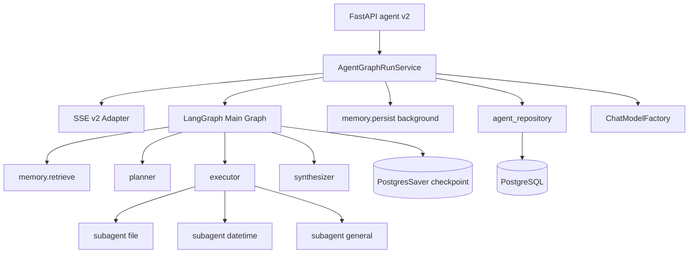

# Agent 模块 LangGraph 大改设计

**日期**：2026-05-16  
**状态**：已实现（2026-05-18 按代码回填修订；原 2026-05-16 定稿）  
**范围**：一次性替换 `backend/app/agent` 自研编排（skills / ToolRegistry / 手写 tool loop），采用 **LangGraph（外层）+ `create_react_agent`（子 Agent）**；新增 **Plan-and-Execute**、**子 Agent**、**长期记忆（SQL，无向量）**；**破坏性**更新 HTTP API 与 SSE v2；前后端同 PR 落地。

---

## 1. 背景与目标

### 1.1 背景

当前 Agent 为薄编排层：`AgentRunService` + 磁盘 `skills/`（`SKILL.md` + `tools.py`）+ `ToolRegistry` + 手写最多 2 轮 LLM↔tool 循环；SSE 为 OpenAI `chat.completion.chunk` 透传 + `minerva` v1 扩展。无显式规划器、无子 Agent、无长期记忆检索。

### 1.2 目标

| 目标 | 说明 |
|------|------|
| LangChain 标准 | Tools 使用 `@tool`；子 Agent 使用 `create_react_agent`；编排使用 LangGraph |
| Plan-and-Execute | 显式 Planner 产出结构化计划；Executor 按步路由子 Agent |
| 子 Agent | `general` / `file` / `datetime`（可扩展），各为独立 ReAct 子图 |
| Memory | 短时：会话消息 + 可选 LangGraph checkpoint；长期：结构化表 + 消息 fallback |
| 可观测 | SSE v2 输出 assistant/reasoning 流、工具调用、计划步骤、子 Agent、图节点 |
| 模型托管 | Run 请求仅传 `model_id`，服务端从 `SysModel` 取连接信息 |

### 1.3 非目标（首期）

- 向量数据库 / embedding 长期记忆
- 任意用户上传 skill 包（能力在 `backend/app/agent/skills/` 内置目录）
- 将每个上游 token 单独写入 `agent_run_node`
- 旧版 SSE（OpenAI chunk + `minerva` v1）兼容

### 1.4 已确认的架构决策

| 项 | 决策 |
|----|------|
| 交付 | 一次性大改，前后端同 PR |
| 编排 | 外层 LangGraph；子 Agent 内层 `create_react_agent` |
| 规划模式 | **Plan-and-Execute + 子 Agent** |
| 长期记忆 | 结构化表 + 消息 ILIKE fallback；run 结束写入 |
| API/SSE | 破坏性变更（v2）；仍需工具、思考、编排日志 |
| 模型 | 服务端托管 `model_id` → `SysModel` |
| 技能 | 保留磁盘 `skills/`（`INDEX.md` + `SKILL.md` + `tools.py`）；**未**迁到 `capabilities/`（见 §14） |

---

## 2. 总体架构

```text
backend/app/agent/
  api/v2/                    # FastAPI 路由
  domain/                    # Plan、SSE v2 类型、ORM
  skills/                    # 内置技能包（INDEX.md + SKILL.md + tools.py）
    general/
    file/
    datetime/
  infrastructure/
    skill_loader.py          # Planner 路由 + build_skill_react_agent
  graphs/
    state.py                 # AgentGraphState (TypedDict)
    main.py                  # 主图 compile
    nodes/                   # planner, executor, memory_*, synthesizer
  infrastructure/
    chat_model_factory.py    # SysModel → LangChain ChatModel
    memory_store.py          # 长期记忆 SQL
    sse_emitter_v2.py
    event_mapper.py          # astream_events → SSE v2
  service/
    agent_graph_run_service.py
```



**与 `app/llm`**：LangChain `ChatModel` 由 `ChatModelFactory` 根据 `SysModel` 构造（`langchain-openai` 等）。若需统一重试/日志，工厂内部可复用 `app/llm` 的 provider 映射逻辑，但不保留手写 `AgentRunService` 循环。

**删除/废弃**：`skill_loader`、`skill_resolver`、`skill_tools`、`tool_registry`、磁盘 `skills/`、`AgentRunService`（v1）、`sse_chunk_emitter`（v1）、`domain/sse_minerva.py`（v1）。

---

## 3. LangGraph 主图与子 Agent

### 3.1 图状态 `AgentGraphState`

| 字段 | 类型 | 说明 |
|------|------|------|
| `session_id`, `run_id`, `workspace_id`, `user_id` | UUID | 上下文 |
| `model_id` | UUID | `SysModel.id` |
| `user_message` | str | 本轮用户输入 |
| `plan` | `Plan \| None` | 结构化计划 |
| `current_step_index` | int | 当前执行步 |
| `retrieved_memories` | `list[MemoryHit]` | 检索结果 |
| `messages` | `list[BaseMessage]` | 累积消息（供 synthesizer） |
| `subagent_results` | `list[StepResult]` | 每步输出 |
| `final_answer` | `str \| None` | 最终答复 |
| `error` | `AgentError \| None` | 致命错误 |

### 3.2 主图节点与边

```text
START
  → memory.retrieve
  → planner
  → executor ──(还有 step)──→ executor
            └──(无 step)────→ synthesizer
  → END

(Run 成功结束后，service 层异步 schedule_persist_turn_memory_background，非图内节点)
```

| 节点 | 职责 |
|------|------|
| `memory.retrieve` | 长期记忆 SQL 检索；不足则 `agent_message` fallback |
| `planner` | 根据 user_message、memories、能力清单生成 `Plan` |
| `executor` | 执行当前 plan step；按 step 的 skill id 动态 `build_skill_react_agent()` 并 `ainvoke`（**非**独立图节点 `subagent.*`） |
| `synthesizer` | 汇总各步结果为面向用户的最终回复（流式） |
| `memory.persist`（后台） | Run 成功后由 `memory_persist_service` 异步 LLM 抽取并写入长期表；写入 `agent_run_node`（`node_type=memory.persist`） |

### 3.3 子 Agent

| 子 Agent | Tools | 说明 |
|----------|-------|------|
| `general` | 无或极少 | 纯对话、汇总 |
| `file` | `list_dir`, `read_file`, `write_file`, `delete_path`, `mkdir`, `move_path` | 复用 `AgentFileSandbox`，改为 `@tool` |
| `datetime` | `get_system_datetime` | 迁自现实现 |

每个 skill 包（实际目录）：

```text
skills/<name>/
  SKILL.md     # 描述 + Planner 路由触发词
  tools.py     # register_tools(ctx) -> list[@tool]
```

子 Agent 由 `skill_loader.build_skill_react_agent(skill_id, model, ctx)` 在 executor 内按需编译，无 per-skill `agent.py`。

子 Agent 的 `astream_events` 由 `event_mapper` 打上 `capability`、`plan_step_id` 后并入主流。

### 3.4 Planner 约束

- 简单问候：plan 仅 1 步 `general`
- 文件任务：允许多步（如先 `list_dir` 再 `read_file`）
- `agent_max_plan_steps`（默认 8）上限
- `agent_subagent_recursion_limit`（默认 16）限制子 Agent ReAct 深度
- Planner JSON 解析失败：重试 1 次；仍失败则降级为单步 `general` plan，记录 warning 节点

### 3.5 经典 Agent 映射

| 概念 | 实现 |
|------|------|
| Memory 短时 | `agent_message` 跨 run；`PostgresSaver` run 内 checkpoint（`thread_id = {session_id}:{run_id}`）；上下文窗口截断 |
| Memory 长期 | `agent_long_term_memory` + `memory.retrieve` / `memory.persist` |
| Tools | `@tool` + `create_react_agent` |
| Planning | `planner` 节点 → `agent_plan` 表 + SSE `plan.*` |
| Action loop | executor 逐步 + 子 Agent 内 ReAct |
| Sub-agents | file / datetime / general |
| Observability | `agent_run_node` + SSE v2 |

---

## 4. Memory

### 4.1 短时记忆

| 层 | 存储 | 用途 |
|----|------|------|
| 对话历史 | `agent_message`（可增 `message_json`） | 跨 run 重建 LangChain messages |
| 图 checkpoint | LangGraph `AsyncPostgresSaver` | 单 run 图状态；`thread_id = f"{session_id}:{run_id}"` |
| 窗口截断 | service 层 | 按 `SysModel.context_size` 截断 |

### 4.2 长期记忆（SQL，无向量）

**表 `agent_long_term_memory`**

| 列 | 说明 |
|----|------|
| `id` | UUID PK |
| `workspace_id` | FK，必填 |
| `session_id` | FK，可空（空=工作区级） |
| `kind` | `fact` \| `preference` \| `summary` \| `episode` |
| `key` | 可选短键 |
| `content` | text |
| `tags` | JSONB 或 `text[]` |
| `source_run_id`, `source_message_id` | 溯源 |
| `created_at`, `expires_at` | 时间 |

**检索（`memory.retrieve`）**

1. `workspace_id` + (`session_id` 匹配或 NULL) + `kind`/tags/key 条件 + `content` ILIKE 关键词
2. 命中不足 K 条 → `agent_message` 最近 N 条 `content ILIKE`（N=`agent_message_fallback_limit`，默认 50）
3. 结果注入 planner / executor 上下文（字符上限可配置）

**写入（`memory.persist`）**

- 使用 `model_id` 对应模型做结构化抽取：`summary` 一条；`fact` 0～N 条
- 同 `workspace_id` + `key` 的 `fact` 做 upsert
- 失败不阻断 run `success`；记 `agent_run_node` failed

---

## 5. SSE v2

### 5.1 信封

```json
{
  "v": 2,
  "type": "llm.delta",
  "run_id": "uuid",
  "session_id": "uuid",
  "ts": "ISO-8601",
  "payload": {}
}
```

- Media type: `text/event-stream`
- 结束: `data: [DONE]\n\n`
- 响应头: `X-Minerva-Run-Id`

### 5.2 事件类型

| `type` | 说明 |
|--------|------|
| `run.started` / `run.finished` / `run.error` | Run 生命周期 |
| `plan.created` | Planner 输出；`payload.steps[]` |
| `plan.step_updated` | 步骤状态 |
| `graph.node` | 对应 `agent_run_node` 快照 |
| `subagent.started` / `subagent.finished` | 子 Agent 边界 |
| `llm.delta` | `payload.channel`: `assistant` \| `reasoning`；`payload.text` |
| `tool.started` / `tool.finished` | 工具调用与结果预览 |
| `memory.retrieved` | 检索命中摘要（脱敏） |
| `message.final` | synthesizer 最终定稿正文 |

### 5.3 映射

`AgentGraphEventMapper` 处理 LangGraph `astream_events`：

- `on_chat_model_stream` → `llm.delta`
- `on_tool_start` / `on_tool_end` → `tool.*`
- 节点 enter/exit → `graph.node` + DB 写入
- planner 完成 → `plan.created`

preview 字段经 `redact_json` 与 `agent_json_snapshot_max_bytes` 截断。

---

## 6. HTTP API v2

前缀：`/workspaces/{workspace_id}/agent/v2`（删除或 410 旧 `/agent` 路由）。

| 方法 | 路径 | 说明 |
|------|------|------|
| `POST` | `/sessions` | 创建会话 |
| `GET` | `/sessions` | 列表 |
| `GET` | `/sessions/{session_id}` | 详情 + 消息 |
| `DELETE` | `/sessions/{session_id}` | 删除（级联） |
| `GET` | `/skills` | 内置技能列表（来自 `skills/INDEX.md`） |
| `POST` | `/sessions/{session_id}/runs` | SSE v2 流 |

**`AgentRunCreateV2`**

```json
{
  "user_message": "string (min 1)",
  "model_id": "uuid",
  "temperature": 0.7,
  "max_tokens": 4096,
  "preferred_skills": ["file"],
  "regenerate_from_message_id": null,
  "regenerate_last_assistant": false
}
```

- `preferred_skills` 仅作 planner 提示，非强制路由
- `regenerate_*` 用于截断历史后重新生成助手回复（实现已落地）
- 服务端 `ChatModelFactory.get(workspace_id, model_id)` 校验 enabled 与归属

---

## 7. 数据模型变更

| 表 | 变更 |
|----|------|
| `agent_session` | 新增 `summary_text`（可选） |
| `agent_message` | 新增 `message_json JSONB`（可选）；保留 `role`, `content`, `seq` |
| `agent_run` | `request_meta_json` 存 `model_id`, `plan_id`；禁止 api_key |
| `agent_run_node` | 扩展 `node_type`：`graph.*`, `plan.*`, `memory.*`, `subagent.*`, `llm.*`, `tool.*` |
| **新建** `agent_long_term_memory` | 见 §4.2 |
| **新建** `agent_plan` | `id`, `run_id`, `steps_json`, `status`, `created_at` |
| **新建** LangGraph checkpoint 表 | `AsyncPostgresSaver` 官方 migration |

---

## 8. 依赖与配置

**`pyproject.toml` 新增（实现时 pin 版本）**

- `langgraph>=0.2`
- `langchain>=0.3`
- `langchain-core>=0.3`
- `langchain-openai>=0.2`
- `langgraph-checkpoint-postgres>=2.0`

**配置项**

| 键 | 默认 | 说明 |
|----|------|------|
| `agent_max_plan_steps` | 8 | Planner 最大步数 |
| `agent_subagent_recursion_limit` | 16 | 子 Agent ReAct 深度 |
| `agent_memory_retrieve_limit` | 20 | 长期记忆检索条数上限 |
| `agent_message_fallback_limit` | 50 | 消息 fallback 条数 |
| `agent_tool_timeout_seconds` | 60 | 单 tool 超时 |
| `agent_json_snapshot_max_bytes` | 65536 | 节点 JSON 快照上限 |
| `agent_files_root` / `agent_file_max_bytes` | 现有 | 文件沙箱 |

---

## 9. 错误处理与安全

| 场景 | 行为 |
|------|------|
| `model_id` 无效 | HTTP 400，不开启 SSE |
| Planner 失败 | 重试 1 次 → 降级单步 general |
| Tool 失败 | 错误 JSON 回传子 Agent；步骤可标 failed |
| `memory.persist` 失败 | run 仍可 success |
| 未捕获异常 | `run.error` + `run.finished(failed)` |

- API Key 仅服务端使用，禁止写入 `agent_run_node.inputs_json`
- file 工具继续 `AgentFileSandbox` 路径校验
- 长期记忆按 `workspace_id` 隔离

---

## 10. 前端变更（`minerva-ui`）

- API：`minerva-ui/src/api/agent.ts`（v2 全量）+ `agent-stream-v2.ts`
- `AgentsPage`：reasoning 折叠、processLog 轨迹；**无**独立计划步骤面板
- Run 请求当前 `preferred_skills: []` 硬编码；**无** `/` 技能前缀选择器（Planner 自动路由）
- 模型选择仍来自 `listModelProviders`，run 只传 `model_id`

---

## 11. 测试

| 层级 | 内容 |
|------|------|
| 单元 | `MemoryStore`、`ChatModelFactory`、`Plan` 解析、`AgentGraphEventMapper` |
| 集成 | mock LLM 走完整图 planner→executor→subagent |
| API | SSE v2 事件序列（httpx stream） |
| 迁移 | alembic up/down smoke |

---

## 12. 实现顺序（单 PR 内建议）

1. 依赖 + ORM + Alembic migration（含 checkpoint 表）
2. `capabilities/*` + `ChatModelFactory`
3. LangGraph 主图 + PostgresSaver
4. `AgentGraphRunService` + SSE v2 emitter/mapper
5. API v2；删除 v1 agent 代码与 `skills/`
6. 前端 v2
7. 测试

---

## 13. 成功标准（实现核对，2026-05-18）

- [x] `POST .../agent/v2/sessions/{id}/runs` 返回 SSE v2，含 reasoning、tool、plan、subagent 事件
- [x] 文件类问题经 planner 多步路由 `file` 子 Agent 并可读写沙箱
- [x] 同 session 第二次 run 能利用 `agent_message` + 长期记忆表衔接上下文
- [x] Run 结束后 `agent_long_term_memory` 有新 summary/fact（成功路径，后台 persist）
- [x] 旧 agent v1 路由已移除
- [x] 无 api_key 出现在 DB 快照或 SSE 中
- [ ] 前端独立计划步骤 UI（未做）
- [ ] `graph.node` / `message.final` SSE 事件（枚举保留，`message.final` 不发送；`graph.node` 未发射）
- [ ] 迁 `capabilities/` 并删除 `skill_loader`（未做，见 §14）

---

## 14. 实现对照（以代码为准，2026-05-18）

| 项 | 原 spec / 计划 | 当前代码 |
|----|----------------|----------|
| 技能目录 | `capabilities/` | `backend/app/agent/skills/` + `skill_loader.py` |
| 列表 API | `/capabilities` | `GET .../agent/v2/skills` |
| Run 字段 | `preferred_capabilities` | `preferred_skills`（`api/v2/schemas.py`） |
| 主图 | 含 `memory.persist` 节点 | `graphs/main.py` 止于 `synthesizer→END`；persist 在 `memory_persist_service` 后台 |
| 子 Agent | 独立图节点 | `executor_node` 内动态 ReAct |
| 状态 `messages` | `list[BaseMessage]` | **未**入 `AgentGraphState` |
| LTM 列 `source_message_id` | 有 | ORM **无**此列 |
| 配置 | `agent_tool_timeout_seconds` 等 | **未**配置项 |
| 技术设计汇总 | — | 见 `docs/agent-module-design.md` |

**已删除（符合 spec 意图）**：`AgentRunService`、`tool_registry`、`skill_resolver`、`skill_tools`、`sse_minerva`、v1 API、`openai-stream.ts`。
