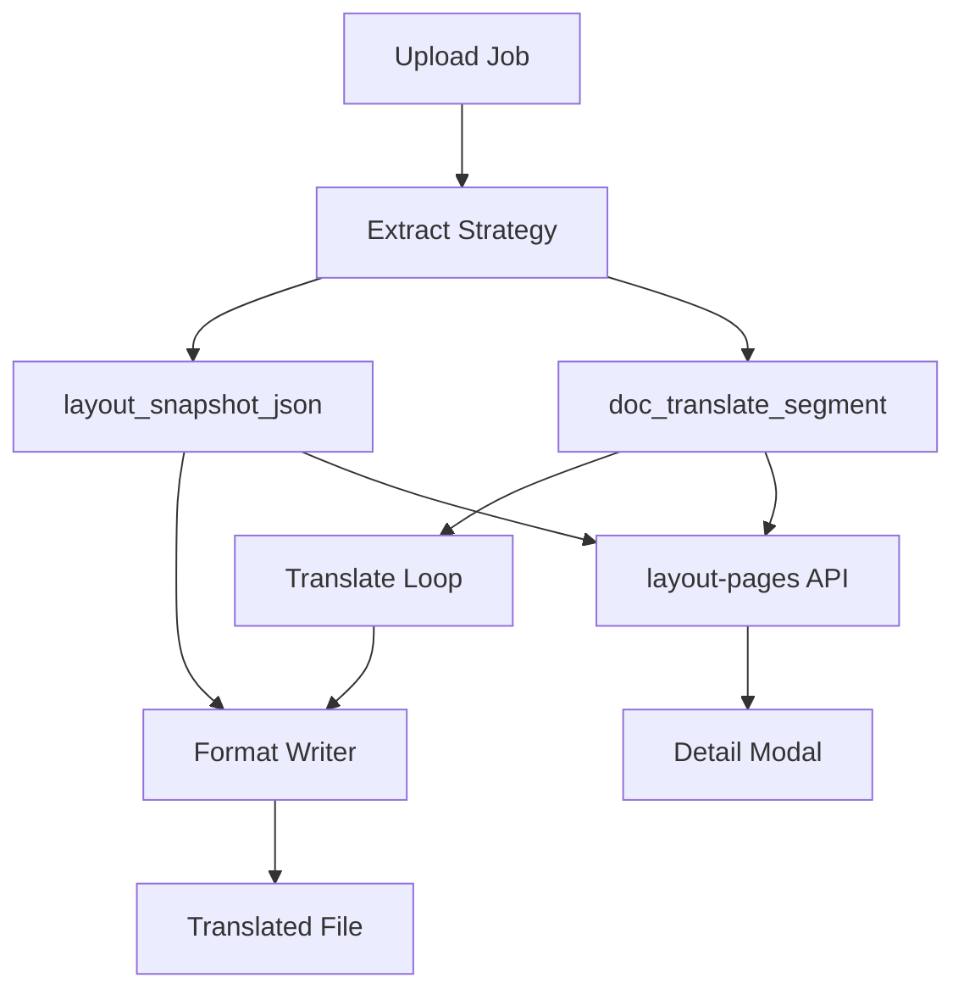

# 文档翻译质量修复设计说明

**日期**：2026-05-23
**状态**：设计已确认，待实施
**范围**：工作区文档翻译功能的结果质量、下载文件写回、详情预览与回归测试收敛。保留现有 API、任务状态机、S3、Celery 基础设施与前端主布局。

**关联文档**：

- `docs/superpowers/specs/2026-05-20-document-translate-design.md`
- `docs/superpowers/specs/2026-05-21-document-translate-ui-refresh-design.md`
- `docs/superpowers/specs/2026-05-22-layout-preserving-ocr-translate-design.md`

---

## 1. 背景与问题

文档翻译已经具备上传、异步任务、段落翻译、详情对照和下载能力；后续又加入了 Layout Document Model（LDM）与 `layout-pages` 预览。当前主要不足不是缺少入口，而是「已标记实现的排版保真能力」与实际代码路径存在差距。

### 1.1 用户可见问题

- **下载文件结构不稳定**：PDF、DOCX、XLSX、CSV、MD 的写回仍依赖各策略的简化 `assemble()`，没有统一 `LayoutWriter`，容易出现段落样式丢失、表格列数变化、CSV 分隔符被翻译、Markdown 代码块被翻译等问题。
- **排版保真承诺未完全落地**：`backend/app/layout/overflow.py` 已有 `fit_text_to_box()`，但没有 writer 层消费它；`backend/app/layout/` 也没有 `writers/` 目录。
- **结构化格式被整段交给 LLM**：CSV 行、Excel 行、Markdown fenced code 作为普通文本翻译时，LLM 可能改动格式符号或代码内容。
- **详情页数据源重复且回退提示不够明确**：`TranslatePage.tsx` 同时请求 `group_by=none` 和 `group_by=page`，页面对照与段落对照可能出现加载状态不同步；layout 不可用时需要明确告诉用户可切换段落对照。
- **测试覆盖不足**：翻译策略、layout-pages、下载错误态、前端详情交互缺少稳定回归测试，难以防止后续改动再次破坏结构。

### 1.2 非目标

- 不重做模型配置、S3 存储、Celery worker、字典管理或权限体系。
- 不引入术语表、翻译记忆、失败段单独重试、SSE 进度推送。
- 不把本轮作为 PDF 完整编辑器或复杂多栏重排系统；PDF 仍以「肉眼可接受的保真」为目标。
- 不删除历史任务兼容逻辑；旧任务没有 LDM 时仍允许回退到段落或 markdown 预览。

---

## 2. 目标与成功标准

### 2.1 目标

- 让翻译下载结果尽量保持原文件结构：段落、表格、单元格、CSV 字段、Markdown 代码块和公式不被误改。
- 让 LDM 成为抽取、预览、组装的统一依据，实际 writer 消费 `layout_snapshot_json`、`anchor_json` 和 `fit_text_to_box()`。
- 让详情页的数据加载和错误回退清晰可信，用户能区分「任务失败」和「该任务无版面数据」。
- 建立后端与前端回归测试，覆盖本次修复的核心行为。

### 2.2 成功标准

- 含公式或 fenced code 的文档翻译后，对应块不调用 LLM，译文与原文一致。
- CSV / XLSX / XLS 写回保持原字段数、行列位置和 sheet 信息；写回前若结构不匹配，使用原字段级锚点兜底，不把破坏性译文直接写入文件。
- DOCX 写回尽量保留 run 与 table cell 样式，不再用整段 `.text` 替换作为唯一实现。
- PDF 文字层使用 bbox 替换并调用 `fit_text_to_box()`；扫描 PDF 使用页图底图 + bbox 叠字，skip 块不覆盖。
- `layout-pages` 不可用时前端显示可理解的回退提示，段落对照仍可查看。
- 后端策略 roundtrip/API 测试和前端详情交互测试能在本地稳定运行。

---

## 3. 总体方案

采用方案 C：完整收敛。保留现有产品入口和 API，把质量问题修在抽取、翻译、组装、预览和测试闭环中。



关键决策：

- `extract()` 继续负责把源文件转成 `SegmentDraft[]`，并写入足够稳定的 `anchor_json`。
- `run_pipeline.py` 继续负责状态机和 LLM 调用，但 skip 块必须直接复制原文。
- `assemble()` 不再各自散落复杂逻辑，而是委托 `backend/app/layout/writers/`。
- 前端详情以页分组段落作为主数据源，layout 预览失败不影响段落对照。

---

## 4. 后端设计

### 4.1 Writer 分层

新增 `backend/app/layout/writers/`：

| 文件 | 职责 |
|------|------|
| `base.py` | 定义 writer 协议与 `WriteContext`，包含源路径、输出路径、layout snapshot、segments |
| `text_writer.py` | TXT / MD / CSV 的结构化文本写回 |
| `docx_writer.py` | DOCX 段落与表格单元格写回，保留 run / cell 基础样式 |
| `spreadsheet_writer.py` | XLSX / XLS 按 sheet / row / col 写回 |
| `pdf_writer.py` | PDF bbox 替换、扫描页图叠字、溢出处理 |
| `registry.py` | 根据后缀选择 writer |

策略层 `assemble()` 变薄，只负责调用 writer。这样后续补格式时不会继续复制写回逻辑。

### 4.2 Segment Anchor 规范

为结构化格式统一 anchor 字段：

```json
{
  "block_key": "sheet1.r3.c2",
  "page_index": 0,
  "label": "table_cell",
  "sheet_name": "Sheet1",
  "row": 3,
  "col": 2,
  "field_index": 1,
  "skip_translate": false,
  "overflow_policy": "expand"
}
```

要求：

- `block_key` 在一个任务内稳定唯一。
- `skip_translate=true` 的段不调用 LLM，写回时强制使用 `source_text`。
- `table_grid`、`sheet_name`、`row`、`col`、`field_index` 用于结构化写回，不依赖译文中的分隔符推断结构。
- 老任务 anchor 缺字段时，`layout_pages.py` 保留现有兼容归一化。

### 4.3 格式策略修复

#### TXT

- 继续按空行/长文本分段。
- 写回按 `seq` 双换行拼接。
- 测试覆盖长段拆分后顺序稳定。

#### Markdown

- fenced code 块标记 `skip_translate=true`。
- 普通段落翻译；标题、列表、引用尽量保持 Markdown 片段。
- 写回时 skip 块原样保留，避免代码块被翻译或 fence 损坏。

#### CSV

- 抽取阶段使用标准 `csv` parser，而不是整行字符串。
- 每个可翻译字段生成一个 segment，anchor 包含 `row`、`field_index`。
- 写回时读取原 CSV 行，按字段位置替换译文字段，保留 delimiter、quote 策略和行数。
- 若某行字段数量异常，保留原字段并记录 segment warning，不直接写入破坏性整行。

#### XLSX / XLS

- 抽取阶段按单元格生成 segment，而不是整行 tab 拼接。
- anchor 包含 sheet、row、col；写回只替换对应单元格的 value。
- XLSX 保留 openpyxl workbook 样式；XLS 使用现有 xlrd/xlwt 路径时尽量复制原值，样式保留作为尽力目标。

#### DOCX / DOC

- DOC 仍经 LibreOffice 转 DOCX，再按 DOCX 处理，最后按需转回 DOC。
- DOCX 段落写回优先替换首个 run 文本并清空后续 run，保留段落和 run 的基础样式；表格单元格同理。
- 不再以 `paragraph.text = translated` 作为主要路径，避免清空 run 样式。

#### PDF

- 文字层 PDF：继续使用 PyMuPDF blocks 和 bbox，但写回时调用 `fit_text_to_box()` 决定字号与截断；公式/图片 skip 块不覆盖。
- 扫描 PDF：若存在 OCR 页图，输出文件以页图为底图，在 bbox 中叠加译文；无 bbox 时降级为页内顺序文本。
- 对被截断的文本记录 warning，后续可在 UI 暴露；本轮先保证不抛出未处理异常。

### 4.4 Pipeline 与错误处理

- `run_pipeline.py` 保持单任务状态机不变。
- 翻译循环继续串行，降低本次修复的并发风险。
- 单段失败仍使任务失败，这是既有非目标；但失败信息要保留 `error_code` / `error_message`，前端能展示。
- `download` API 继续只允许 `SUCCESS` 且 `result_object_key` 存在，否则返回 `translate.download_not_ready`。

---

## 5. 前端设计

### 5.1 详情数据源

`TranslatePage.tsx` 调整为：

- 以 `listTranslateJobSegments(..., 'page')` 作为主段落数据源。
- 扁平段落列表由 page groups 派生，除非确有兼容需求才请求 `group_by=none`。
- `layout-pages` 与 `segments` 的轮询节奏跟随 job 状态；终态停止轮询。

### 5.2 预览回退

- `layout-pages` 返回 404 或 `layout.blocks_missing` 时，不把详情判为失败。
- 页面 Tab 显示提示：「该任务无版面数据，可查看段落对照」。
- 段落对照 Tab 保持可用，使用 `MinervaMarkdown preset="ocr"` 渲染 source / target。

### 5.3 下载与错误态

- 下载失败时优先展示后端 `ApiError.message`，再退回通用提示。
- `SUCCESS` 但无 `result_object_key` 的状态由后端 409 兜底，前端展示「译文尚未就绪」。
- 进行中任务的译文占位使用明确 pending 状态，不把空译文误显示成完成。

---

## 6. 测试计划

### 6.1 后端

新增或恢复以下测试：

- `test_translate_txt_strategy.py`：长文本分段与 roundtrip。
- `test_translate_md_strategy.py`：fenced code skip，不调用 LLM，写回原样。
- `test_translate_csv_strategy.py`：字段级翻译保持列数、引号与行数。
- `test_translate_xlsx_strategy.py`：按 sheet / row / col 写回单元格。
- `test_translate_docx_strategy.py`：段落和表格单元格写回，基础样式不被整体清空。
- `test_translate_pdf_strategy.py`：bbox 写回调用 overflow，skip 块不覆盖。
- `test_translate_layout_pages_api.py`：snapshot、OCR 回退、segments 回退。
- `test_translate_download_api.py`：非 SUCCESS / 无结果对象返回 409。
- `test_translate_pipeline_skip_blocks.py`：公式或代码块段不调用 LLM。

### 6.2 前端

若项目已有测试框架则复用；若没有，本轮以最小测试配置为目标：

- 列表筛选参数正确传给 `listTranslateJobs`。
- 上传成功后关闭上传 Modal 并打开详情。
- `layout-pages` 不可用时显示回退提示，段落对照仍渲染。
- 下载失败时显示后端错误消息。

### 6.3 手工冒烟

- 上传含代码块的 Markdown，确认代码块原样、普通段落被翻译。
- 上传含多列 CSV，确认输出列数和引号不变。
- 上传含表格的 DOCX / XLSX，确认表格结构不变。
- 上传文字层 PDF 与扫描 PDF，确认详情可预览，下载文件可打开。

---

## 7. 文档回填

实施完成后同步更新：

- `docs/superpowers/specs/2026-05-20-document-translate-design.md`：补充 doc/xls 支持现状、结构化格式字段级写回。
- `docs/superpowers/specs/2026-05-22-layout-preserving-ocr-translate-design.md`：将 LayoutWriter 的真实代码路径写入「实现对照」。
- README 是否收录文档翻译功能可作为后续独立文档任务；本轮不强制。

---

## 8. 实施顺序建议

1. 后端测试先行：为 MD / CSV / XLSX / skip 块写失败测试。
2. 新增 writer 基础协议与 text / csv / spreadsheet writer。
3. 改造 MD、CSV、XLSX/XLS 策略到字段级 anchor。
4. 改造 DOCX writer，减少 `.text` 直接替换造成的样式丢失。
5. 改造 PDF writer，接入 `fit_text_to_box()` 与 skip 块。
6. 调整 `run_pipeline.py` 与 `layout_pages.py` 的兼容和错误路径。
7. 调整 `TranslatePage.tsx` 数据源、layout 回退和下载错误提示。
8. 补齐前端测试与手工冒烟，最后回填旧 spec 实现对照。

---

## 9. 风险与取舍

- DOCX run 级样式保留是尽力目标，不保证复杂嵌套域、批注、脚注全部无损。
- PDF bbox 叠字无法处理所有复杂多栏与图文避让，本轮目标是稳定可打开、skip 块不误覆盖、正文尽量放入 bbox。
- CSV dialect 自动识别可能失败；失败时采用标准库默认 dialect，并在测试中覆盖常见逗号/引号场景。
- 若前端当前没有测试框架，新增测试配置会增加少量工程改动；可以在实施计划中单独列为一步。

---

## 10. 验收清单

- [ ] 所有新增后端策略/API 测试通过。
- [ ] 前端 lint/build 通过；若新增前端测试，测试通过。
- [ ] Markdown fenced code、公式块未被 LLM 翻译。
- [ ] CSV / XLSX / DOCX / PDF 下载文件可打开，结构没有明显破坏。
- [ ] 详情页 layout 不可用时能回退到段落对照。
- [ ] 旧设计文档已回填实现对照。
