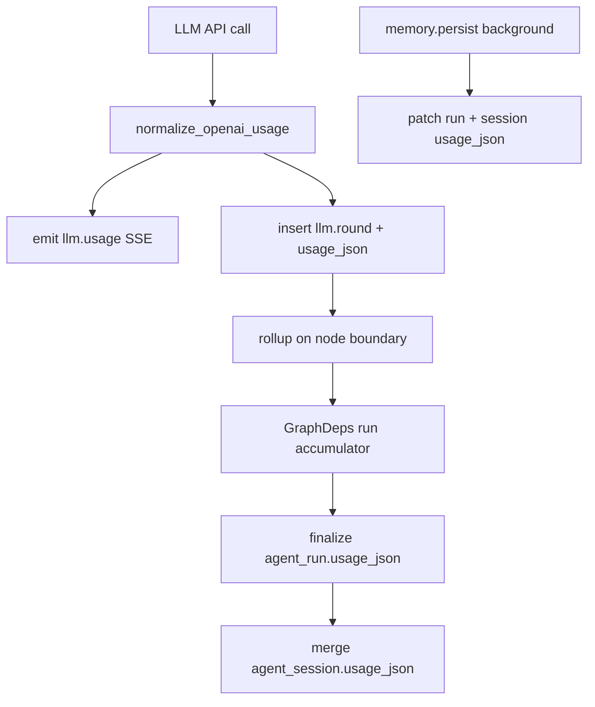

# Agent Token 用量分层统计设计

**日期**：2026-05-26  
**状态**：已实现（2026-05-26）  
**范围**：Agent v2 Run 链路中每次 LLM 调用的 token 采集、主图节点汇总、Run/Session 持久化、SSE 与 HTTP API 扩展  
**关联**：[Agent 模块技术设计](../../agent-module-design.md)、[Agent LangGraph 大改设计](2026-05-16-agent-langgraph-redesign-design.md)

---

## 1. 背景与目标

### 1.1 背景

Agent v2 已具备 Run 级 token 累计（`GraphDeps.accumulated_usage`）、SSE `llm.usage` 事件，以及 `agent_run.usage_json` 落库。缺口包括：

- Planner、后台 `memory.persist` 未采集 usage
- 无每次 LLM API 调用的持久明细
- `agent_run_node` 无 usage 字段
- `agent_session` 无跨 Run 累计
- HTTP 会话详情不返回 usage

### 1.2 目标

| 目标 | 说明 |
|------|------|
| B 层明细 | 每次 LLM API 调用一条记录（含 ReAct 子 Agent 多轮） |
| A 层汇总 | 主图节点边界 rollup：planner、每个 plan step（subagent）、synthesizer、memory.persist |
| Run 全量 | 单次 Run 完整 `usage_json`（含 `by_phase` / 多步时 `by_step`） |
| Session 全量 | 会话下**所有 Run**（含重新生成、含失败 Run 已 finalize 部分）+ 后台 memory.persist，累计到 `agent_session.usage_json` |
| 按需字段 | JSON 仅写入各阶段实际上游返回的 token 类型；未出现的键省略 |

### 1.3 非目标（本期）

- 计费、配额拦截、工作区/用户级账单
- 将 streaming delta 逐 token 写入 DB（仍为非目标）
- `memory.retrieve` 检索（无 LLM 调用）
- 独立 Run 历史列表 API

### 1.4 已确认决策

| 项 | 决策 |
|----|------|
| 统计粒度 | **分层 C**：每次 LLM 调用 + 主图节点汇总 |
| 会话范围 | **全量 C**：所有 Run + memory.persist |
| 持久化 | **三层 A**：`agent_run_node`、`agent_run`、`agent_session` 均存 `usage_json` |
| 实现路径 | **方案 3（混合式）**：LLM 调用写 `llm.round` 节点；节点边界 rollup；Run/Session  denormalized 快照 + memory.persist 二次 patch |
| 失败 Run | 已发生的明细与部分 rollup **保留**；finalize 时仍写当前累计 usage |
| Session 与 failed Run | failed Run 若已 finalize 且写过 usage，**计入** Session 累计 |

---

## 2. `usage_json` 结构

DB 列名统一为 **`usage_json`**（JSONB）；HTTP 响应字段对外命名为 **`usage`**（与列内容一致）。

### 2.1 标准键（OpenAI 兼容）

沿用 `backend/app/agent/infrastructure/openai_usage.py` 归一化：

| 键 | 说明 |
|----|------|
| `prompt_tokens` | 输入 token（含 LangChain `input_tokens` 映射） |
| `completion_tokens` | 输出 token（含 `output_tokens`） |
| `total_tokens` | 合计；缺失时由 prompt + completion 推导 |

### 2.2 扩展键（按需）

```json
{
  "details": {
    "cached_tokens": 200,
    "reasoning_tokens": 64
  }
}
```

- 上游响应中出现的额外 token 类型写入 `details`
- 已知键（如 `cached_tokens`、`reasoning_tokens`）在 merge 时**同键相加**
- 未知键可原样保留在 `details` 中，merge 时若双方均为数值则相加

### 2.3 分层键（Run / Session 级快照）

```json
{
  "prompt_tokens": 1200,
  "completion_tokens": 380,
  "total_tokens": 1580,
  "details": { "cached_tokens": 200 },
  "by_phase": {
    "planner": { "prompt_tokens": 800, "completion_tokens": 120, "total_tokens": 920 },
    "subagent": { "prompt_tokens": 300, "completion_tokens": 200, "total_tokens": 500 },
    "synthesizer": { "prompt_tokens": 100, "completion_tokens": 60, "total_tokens": 160 },
    "memory.persist": { "prompt_tokens": 50, "completion_tokens": 20, "total_tokens": 70 }
  },
  "by_step": {
    "s1": {
      "prompt_tokens": 300,
      "completion_tokens": 200,
      "total_tokens": 500,
      "skill_id": "file"
    }
  }
}
```

**phase 枚举**：`planner` | `subagent` | `synthesizer` | `memory.persist`  
（用户所称「memory」对应 **`memory.persist`** 阶段 LLM，非 memory.retrieve。）

### 2.4 各层存储范围

| 层级 | `usage_json` 内容 |
|------|-------------------|
| `llm.round` 节点 | 仅本次调用的标准三键 + 可选 `details` |
| `plan.created` / `subagent.run` / synthesizer 节点 / `memory.persist` | 该节点 rollup 后的标准三键 + 可选 `details` |
| `agent_run` | 顶层三键 + `details` + `by_phase` + 多步时 `by_step` |
| `agent_session` | 顶层三键 + `details` + `by_phase`（跨 Run 累计）；**不含** `by_step` |

### 2.5 Merge 规则

- 顶层与 `by_phase` / `by_step` 内对象：标准三键分别相加
- `details`：同键数值相加；一方缺失视为 0
- 合并函数：`merge_usage_document(base, delta)`（基于现有 `merge_openai_usage` 扩展）

---

## 3. 数据模型变更

| 表 | 变更 |
|----|------|
| `agent_run` | 已有 `usage_json`；语义扩展为 §2 分层结构（替换当前 flat sum 约定） |
| `agent_run_node` | **新增** `usage_json JSONB NULL` |
| `agent_session` | **新增** `usage_json JSONB NULL` |

**迁移**

- 增量：`backend/sql/patches/2026-05-26-agent-usage-json.sql`
- 同步：`backend/sql/schema_postgresql.sql`
- ORM：`AgentRunNode.usage_json`、`AgentSession.usage_json`

**约定**：无库级外键；删除会话仍由 `delete_agent_session` 应用层级联清理 Run/Node（见 minerva-conventions）。

---

## 4. 架构与数据流



### 4.1 新增/扩展模块

| 模块 | 职责 |
|------|------|
| `openai_usage.py` | 保留 normalize/extract/merge；新增 `merge_usage_document` |
| `usage_tracker.py`（或扩 `GraphDeps`） | `record_llm_call`、`rollup_node_usage`、`build_run_usage_snapshot`、`patch_session_usage` |
| `repository.py` | `update_run_node_usage`、`merge_session_usage_json` |

### 4.2 LLM 采集点

| phase | 代码位置 | 行为 |
|-------|----------|------|
| `planner` | `graphs/nodes/planner.py` | structured `ainvoke` 后 record；rollup `plan.created` |
| `subagent` | `graphs/nodes/subagent_runner.py` | 每个 `on_chat_model_end` → `llm.round`；step 结束 rollup `subagent.run`，更新 `by_step` |
| `synthesizer` | `graphs/nodes/synthesizer.py` | 流式/invoke 后 record；rollup synthesizer 节点 |
| `memory.persist` | `service/memory_persist_service.py` | `invoke_memory_extract` 后 record；**独立 DB Session** 内 patch `agent_run` + `agent_session` |

### 4.3 `agent_run_node` 树约定

| node_type | 说明 |
|-----------|------|
| `llm.round` | 单次 LLM 调用；`meta_json` 含 `phase`、`step_id`、`skill_id`（按需） |
| `plan.created` | planner 汇总 |
| `subagent.run` / `subagent.finish` | 已有；`subagent.run` 持 step rollup |
| `synthesizer.run` | **新增** synthesizer 边界节点 |
| `memory.persist` | 已有；rollup 含 extract LLM |

**序号**：`llm.round` 作为 `subagent.run` 或 synthesizer 节点的子节点，`sequence_idx` 递增。

### 4.4 Run 生命周期

1. Run 开始：`GraphDeps` 初始化空累计与 phase/step 桶
2. 主图执行：每次 LLM → SSE + `llm.round` + 内存累计
3. 节点边界：rollup 父节点 `usage_json`
4. Run 成功/失败 finalize：写入 `agent_run.usage_json`；成功时 merge 到 `agent_session.usage_json`
5. 后台 memory.persist 完成：再次 merge Run（`by_phase.memory.persist`）与 Session

### 4.5 重新生成

- 每次 regenerate 产生新 `run_id`
- Session 累计为各 Run usage 之和（含历史 failed Run 已写入部分）

---

## 5. SSE v2

不新增 `type`；扩展 payload。

| 事件 | payload 扩展 |
|------|----------------|
| `llm.usage` | 保留 `usage`、`total_usage`、`phase`、`step_id`、`skill_id`；可选 `node_id`（`llm.round` 主键） |
| `subagent.finished` | 可选 `step_usage`（该 step rollup 对象） |
| `run.finished` | `usage` 为完整分层 JSON（与 `agent_run.usage_json` 一致） |

`total_usage` 在 Run 进行中仍为**当前 Run 内存累计**的 flat 三键（与现行为兼容）；Run 结束时以完整 JSON 为准。

---

## 6. HTTP API

| 方法 | 路径 | 变更 |
|------|------|------|
| `GET` | `/workspaces/{workspace_id}/agent/v2/sessions/{session_id}` | 响应 `session.usage` ← `agent_session.usage_json` |
| `GET` | `/workspaces/{workspace_id}/agent/v2/sessions` | 列表项增加 `usage`（至少含 `total_tokens`；完整对象可选） |

Pydantic：`AgentSessionOut.usage`、`AgentSessionListItemOut.usage`（`dict | None`）。

---

## 7. 前端（建议同期）

| 项 | 说明 |
|----|------|
| 进程日志 | 已有 `formatAgentV2TraceLine` 对 `llm.usage` / `run.finished` 的格式化 |
| 会话 UI | 侧栏或会话头展示 Session `usage.total_tokens`；Run 结束展示 `by_phase` 折叠明细 |
| 类型 | 复用 `agent-stream-v2.ts` 中 `OpenAIUsage` / `parseOpenAIUsage`；扩展解析 `by_phase` |

前端可作为独立 implementation task，不阻塞后端落库。

---

## 8. 测试

| 测试 | 覆盖 |
|------|------|
| `test_agent_openai_usage.py` | 扩展 `merge_usage_document`、`details` 相加 |
| `test_agent_usage_tracker.py`（新建） | planner → subagent 多轮 → synthesizer rollup；`by_step` |
| `test_agent_memory_persist_usage.py`（新建） | 后台 patch Run + Session |
| API 测试 | session detail/list 返回 `usage` |

---

## 9. 文档回填

实现完成后更新：

- 本文 **状态** → 已实现
- 新增 **实现对照** 表
- `docs/agent-module-design.md` §7（表结构）、§9.2（SSE `llm.usage` / `run.finished`）

---

## 10. 实现对照（以代码为准，2026-05-26）

| spec 条目 | 代码位置 | 状态 |
|-----------|----------|------|
| `merge_usage_document` | `infrastructure/openai_usage.py` | 已实现 |
| Usage 采集与 rollup | `infrastructure/usage_tracker.py` + `graphs/deps.py` | 已实现 |
| Planner usage | `graphs/nodes/planner.py` | 已实现 |
| Subagent llm.round | `graphs/nodes/subagent_runner.py` + `executor.py` | 已实现 |
| Synthesizer usage | `graphs/nodes/synthesizer.py` | 已实现 |
| memory.persist patch | `service/memory_persist_service.py` | 已实现 |
| Run finalize | `service/agent_graph_run_service.py` | 已实现 |
| Session merge | `infrastructure/repository.py` | 已实现 |
| DB 迁移 | `sql/patches/2026-05-26-agent-usage-json.sql` | 已实现 |
| API schemas | `api/v2/schemas.py`, `router.py` | 已实现 |
| 前端展示 | `minerva-ui` AgentsPage + `agentSkillUi.ts` | 已实现（SSE + meta 恢复） |

---

## 附录 A：与现有代码的关系

- **`usage_json` 列名**：与 `agent_run` 现有列一致；API 层映射为 `usage`
- **非目标不变**：不将每个 streaming delta token 写入 `agent_run_node`（LangGraph 大改 spec §1.3）
- **`stream_usage`**：`ChatModelFactory` 已设 `stream_usage=True`，流式 chunk 的 `usage_metadata` 仍用于 synthesizer；最终以 `on_chat_model_end` / `ainvoke` 结果为准
